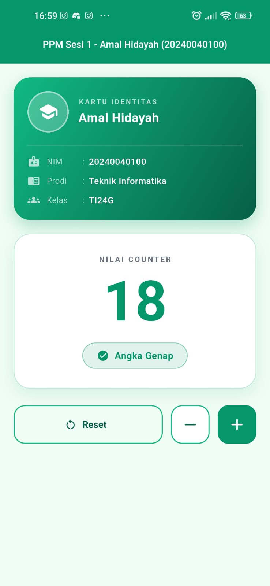
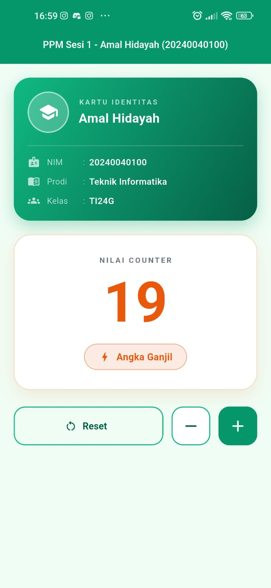

# Counter PPM Sesi 1

Aplikasi Counter sederhana untuk tugas **Praktikum Pemrograman Perangkat Mobile — Sesi 1**.

## Identitas

| Field | Nilai |
---|---
Nama | Amal Hidayah
NIM | 20240040100
Prodi | Teknik Informatika
Kelas | TI24G

## Fitur

- **AppBar** berisi `PPM Sesi 1 - Amal Hidayah (20240040100)`
- **Tema hijau Emerald** (`#059669`) dengan Material 3
- **Kartu identitas** berisi nama, NIM, prodi, kelas, dan ikon
- **Tombol `+`, `-`, dan `Reset`**
- **Angka tidak dapat turun di bawah 0** — muncul SnackBar bila tombol `-` ditekan saat bernilai 0
- **Warna angka berubah sesuai paritas** — hijau saat genap, oranye saat ganjil
- **Status angka** ditampilkan sebagai "Angka Genap" atau "Angka Ganjil"
- Tampilan responsif, tidak overflow di layar sempit

## Screenshot

| Tampilan awal | Setelah interaksi |
|---|---|
|  |  |

## Cara Menjalankan

Pastikan Flutter SDK dan Android SDK sudah terpasang, lalu:

```bash
flutter pub get
flutter run
```

Untuk menjalankan di HP yang disambungkan via USB, aktifkan **Developer options → USB debugging** di HP, lalu:

```bash
flutter devices   # pastikan HP terdeteksi
flutter run
```

## Pengujian

Proyek ini punya dua lapis pengujian:

```bash
# Widget test (4 test, berjalan di PC)
flutter test

# Integration test (1 test, 10 assertions, berjalan di HP asli)
flutter test integration_test -d <id-device>
```

Hasil verifikasi pada perangkat Redmi Note 9 (Android 12):

```
OK 1  AppBar = "PPM Sesi 1 - Amal Hidayah (20240040100)"
OK 2  Kartu identitas = Amal Hidayah | 20240040100 | Teknik Informatika | TI24G
OK 3  Warna tema = #059669 (hijau Emerald)
OK 4  Tombol +, -, dan Reset tersedia
OK 5  Awal: angka 0, status "Angka Genap"
OK 6  +3x -> angka 3, status "Angka Ganjil", warna #EA580C
OK 7  -1x -> angka 2, status "Angka Genap", warna #059669 (beda dari ganjil)
OK 8a Turun ke 0, status "Angka Genap"
OK 8b Tekan "-" saat 0 -> SnackBar muncul, angka tetap 0
OK 9  Reset -> angka 0, status "Angka Genap"
OK 10 Tidak ada overflow / error di layar HP
```

## Struktur Proyek

```
lib/
  main.dart                    # seluruh kode aplikasi
test/
  widget_test.dart             # 4 widget test
integration_test/
  app_test.dart                # uji end-to-end di perangkat
docs/
  screenshot-1.jpeg            # screenshot tampilan awal
  screenshot-2.jpeg            # screenshot setelah interaksi
android/                       # konfigurasi build Android
```

## Teknologi

- Flutter 3.47.5 / Dart 3.13.4
- Material 3
- `ColorScheme.fromSeed` untuk tema
- `AnimatedDefaultTextStyle` dan `AnimatedContainer` untuk transisi warna
